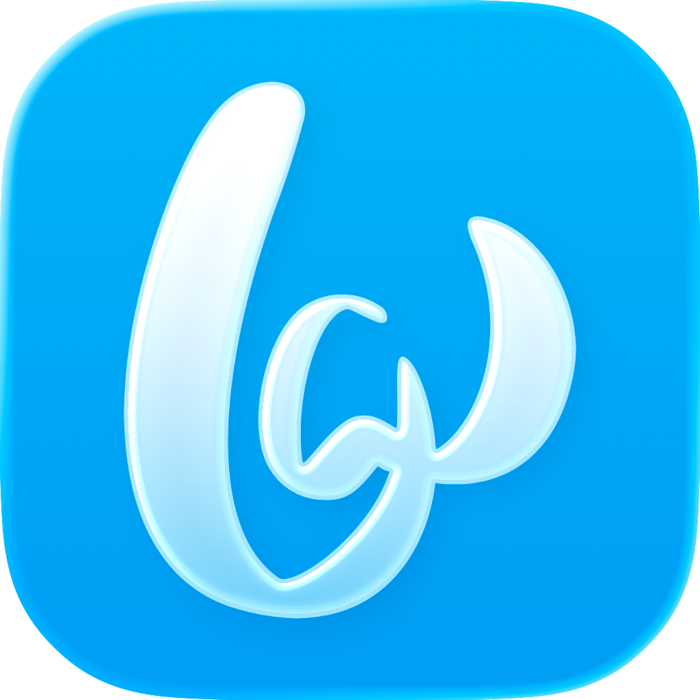

# Bandwidth BRTC Swift Sample Application



A native iOS calling app powered by [Bandwidth's WebRTC (BRTC) SDK](https://dev.bandwidth.com/docs/brtc), demonstrating outbound PSTN dialing and live call quality monitoring.

> **Note:** This project uses the Bandwidth BRTC SDK, which is currently in beta.

## Features

- **Outbound PSTN Calling** — Dial any phone number from the app. Audio flows over WebRTC and bridges to the PSTN via Bandwidth's Voice API.
- **Live Call Stats** — Real-time quality overlay showing jitter, packet loss, round-trip time, bitrate, codec, and audio level — pulled directly from WebRTC's `getStats()` API.
- **Call History** — Track recent calls with direction, duration, and timestamps.
- **Full PSTN ↔ WebRTC Bridge** — Server-side call orchestration using Bandwidth BXML.

## Architecture

```
┌──────────────┐      WebRTC       ┌──────────────┐    Voice API    ┌──────────┐
│   iOS App    │ ◄──────────────►  │  Node Server  │ ◄────────────► │   PSTN   │
│  (BRTC SDK)  │                   │  (Express)    │     BXML       │ Network  │
└──────────────┘                   └──────────────┘                 └──────────┘
     │                                    │
     │ CallKit                            │ Bandwidth
     │ (native call UI)                   │ OAuth + Endpoints API
     ▼                                    ▼
  iOS System                       Bandwidth Platform
```

**Outbound call flow:**
1. User dials a number in the app
2. App sends an outbound connection request via the BRTC SDK
3. Server receives the request, creates a Voice API call to the PSTN number
4. PSTN party answers → server returns `<Connect><Endpoint>` BXML to bridge audio
5. Audio flows: iOS App ↔ WebRTC ↔ Bandwidth ↔ PSTN

## Prerequisites

- **Xcode 15+** with iOS 15.0 SDK or later
- **iPhone** running iOS 15+ (CallKit requires a real device; the simulator uses a fallback UI)
- **Node.js 18+**
- **ngrok** (or similar tunneling tool) for exposing the local server to Bandwidth's webhooks
- **Bandwidth account** with:
  - Account ID, OAuth Client ID, and Client Secret
  - A Voice API Application configured with callback URLs
  - A phone number associated with the application

## Getting Started

### 1. Clone the repository

Clone the repository using `git clone` and change your directory to the cloned repo.

### 2. Start ngrok

The server needs a public URL for Bandwidth to send webhooks. Start ngrok pointing at port 3000:

```bash
ngrok http 3000
```

Copy the `https://` forwarding URL (e.g., `https://a1b2c3d4.ngrok-free.app`).

### 3. Configure the server

```bash
cd server
cp .env.example .env
```

Edit `.env` with your Bandwidth credentials:

```env
# Bandwidth OAuth API Credentials
ACCOUNT_ID=your_account_id
BW_ID_CLIENT_ID=your_client_id
BW_ID_CLIENT_SECRET=your_client_secret

# BRTC Endpoint configuration
CALLBACK_BASE_URL=https://your-ngrok-url.ngrok-free.app
APPLICATION_ID=your_application_id
FROM_NUMBER=+15551234567

# Optional
# BW_ID_HOSTNAME=https://api.bandwidth.com
# VOICE_URL=https://voice.bandwidth.com/api/v2
# HTTP_BASE_URL=https://api.bandwidth.com/v2

# Server port (optional, defaults to 3000)
PORT=3000
```

| Variable | Description |
|----------|-------------|
| `ACCOUNT_ID` | Your Bandwidth account ID |
| `BW_ID_CLIENT_ID` | OAuth client ID from the Bandwidth Dashboard |
| `BW_ID_CLIENT_SECRET` | OAuth client secret |
| `CALLBACK_BASE_URL` | Your public server base URL (for example, your ngrok URL) |
| `APPLICATION_ID` | Voice API Application ID (must have callback URLs configured) |
| `FROM_NUMBER` | Bandwidth phone number in E.164 format (e.g., `+15551234567`) |
| `BW_ID_HOSTNAME` | Optional OAuth host override (defaults to `https://api.bandwidth.com`) |
| `VOICE_URL` | Optional Voice API base URL override |
| `HTTP_BASE_URL` | Optional BRTC API base URL override |

### 4. Configure your Bandwidth Application

In the [Bandwidth Dashboard](https://dashboard.bandwidth.com), set the following callback URLs on your Voice API Application to point to your ngrok URL:

| Callback | URL |
|----------|-----|
| Call Initiated Callback URL | `https://your-ngrok-url.ngrok-free.app/callbacks/bandwidth` |
| Call Status Callback URL | `https://your-ngrok-url.ngrok-free.app/calls/status` |

### 5. Start the server

```bash
cd server
npm install
npm start
```

You should see:

```
BRTC token server running on http://localhost:3000
  Account:    12345
  App ID:     cd13951d-...
  From:       +15551234567
  Callback:   https://your-ngrok-url.ngrok-free.app/callbacks/bandwidth
```

### 6. Build and run the iOS app

1. Open `BRTCSampleApp/BRTCSampleApp.xcodeproj` in Xcode
2. Wait for Swift Package Manager to resolve the `BandwidthRTC` and `WebRTC` dependencies
3. Select your connected iPhone as the build target
4. Build and run (⌘R)
5. On the Connect screen, enter your server URL (e.g., `http://192.168.1.100:3000` or your ngrok URL)
6. Tap **Connect**

### 7. Make a call

**Outbound:** Switch to the Keypad tab, dial a number, tap the green call button.

**Inbound PSTN:** Call your `FROM_NUMBER` from any phone. The call will ring through to the app.

## Project Structure

```
├── Sources/BandwidthRTC/           # BRTC Swift SDK (Swift Package)
│   ├── BandwidthRTC.swift           #   Main public API
│   ├── Signaling/                   #   WebSocket signaling & JSON-RPC
│   ├── Types/                       #   Public types (RtcStream, CallStatsSnapshot, etc.)
│   ├── Utilities/                   #   Logging
│   └── WebRTC/                      #   Peer connection management
│       └── PeerConnectionManager.swift
│
├── BRTCSampleApp/                   # iOS Sample App (Xcode project)
│   └── BRTCSampleApp/
│       ├── App/                     #   App entry point & root ContentView
│       ├── Models/                  #   CallRecord data model
│       ├── ViewModels/              #   CallViewModel (call state machine)
│       ├── Views/                   #   SwiftUI views
│       │   ├── ConnectView.swift    #     Server connection screen
│       │   ├── CallView.swift       #     Dialing, ringing, and in-call screens
│       │   ├── DialpadView.swift    #     12-key dialpad component
│       │   ├── RecentsView.swift    #     Call history list
│       │   └── StatsOverlayView.swift #   Live call quality overlay
│       └── Services/                #   Token fetching, CallKit, call history
│
├── server/                          # Node.js server
│   ├── server.js                    #   Express server — OAuth, endpoints, BXML, call bridging
│   ├── package.json
│   └── .env.example                 #   Environment variable template
│
└── Package.swift                    # Swift Package manifest
```

## Tech Stack

| Layer | Technology |
|-------|-----------|
| iOS App | SwiftUI, CallKit, AVFoundation |
| SDK | BandwidthRTC Swift Package (WebRTC M114) |
| Server | Node.js, Express |
| Voice | Bandwidth Voice API, BXML |
| Tunneling | ngrok (development) |

## API Endpoints

The Node.js server exposes the following:

| Method | Path | Description |
|--------|------|-------------|
| `GET` | `/token` | Creates a WebRTC endpoint and returns a JWT for the BRTC SDK |
| `POST` | `/callbacks/bandwidth` | Handles BRTC events and incoming PSTN call routing |
| `POST` | `/callbacks/bandwidth/status` | Voice API disconnect events |
| `POST` | `/calls/answer` | BXML callback for outbound calls — bridges to WebRTC endpoint |
| `POST` | `/calls/status` | Call status updates |
| `POST` | `/calls/simulate-incoming-answer` | BXML callback for simulated incoming calls |
| `GET` | `/health` | Health check |
| `GET` | `/debug/endpoints` | Inspect the in-memory endpoint map |

## Connecting to a Physical iPhone

When running the app on a real iPhone, it needs to reach the Node.js server over the network. There are two approaches:

### Option A: Internet Sharing over USB (recommended for local development)

If your iPhone and Mac are on a network that blocks device-to-device traffic (common on corporate WiFi), you can share your Mac's network directly to the iPhone over USB:

1. Connect your iPhone to your Mac via USB cable
2. On your Mac, go to **System Settings > General > Sharing > Internet Sharing**
3. Set "Share your connection from" to **Wi-Fi**
4. Check **iPhone USB** in the "To computers using" list
5. Enable Internet Sharing
6. Find the bridge IP address:
   ```bash
   ipconfig getifaddr bridge100
   ```
   This typically returns something like `192.168.3.1`.
7. In the app's Connect screen, enter `http://<bridge-ip>:3000` (e.g., `http://192.168.3.1:3000`)

### Option B: Same Wi-Fi network

If your Mac and iPhone are on the same Wi-Fi network and the network allows device-to-device traffic:

1. Find your Mac's local IP:
   ```bash
   ipconfig getifaddr en0
   ```
2. In the app's Connect screen, enter `http://<mac-ip>:3000` (e.g., `http://192.168.1.100:3000`)

> **Note:** Many corporate and guest Wi-Fi networks use client isolation, which blocks connections between devices. If the connection times out, use Option A or ngrok instead.

### Option C: ngrok

If neither local option works, use ngrok to create a public tunnel:

```bash
ngrok http 3000
```

Enter the `https://` forwarding URL in the app. This also works for testing from any network.

## Troubleshooting

**iPhone can't connect to the server**
- If using a local IP and the connection times out, your network likely blocks device-to-device traffic. Try Internet Sharing over USB (see above) or ngrok.
- Verify the server is running and reachable from your Mac: `curl http://localhost:3000/health`
- Make sure you include `http://` in the server URL

**"No WebRTC endpoint available" when calling the Bandwidth number**
- Make sure the iOS app is connected (green "Connected" state) before calling
- Check that the server logs show the endpoint was created (`GET /token` succeeded)

**Calls disconnect immediately with "rejected"**
- Verify your ngrok tunnel is running and the URL in `.env` matches
- Check that the Bandwidth Application's callback URLs point to your ngrok URL
- Ensure `APPLICATION_ID` matches the application associated with `FROM_NUMBER`

**CallKit doesn't show the incoming call screen**
- CallKit only works on a real device, not the iOS Simulator
- The app includes a fallback ringing UI for simulator testing

**Audio issues (one-way or no audio)**
- Ensure the iOS device has granted microphone permission
- Check that the audio session is configured correctly (the SDK handles this automatically)
- Verify both WebRTC peer connections are established in the server logs

**Stats overlay not appearing**
- Stats only appear during an active call (after the remote party answers)
- If the overlay doesn't show for outbound calls, ensure the server returned `accepted: true`

## License

Copyright (c) Bandwidth Inc. All rights reserved.
